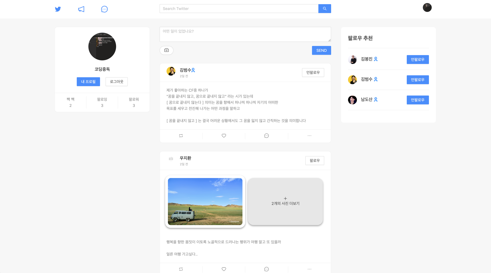
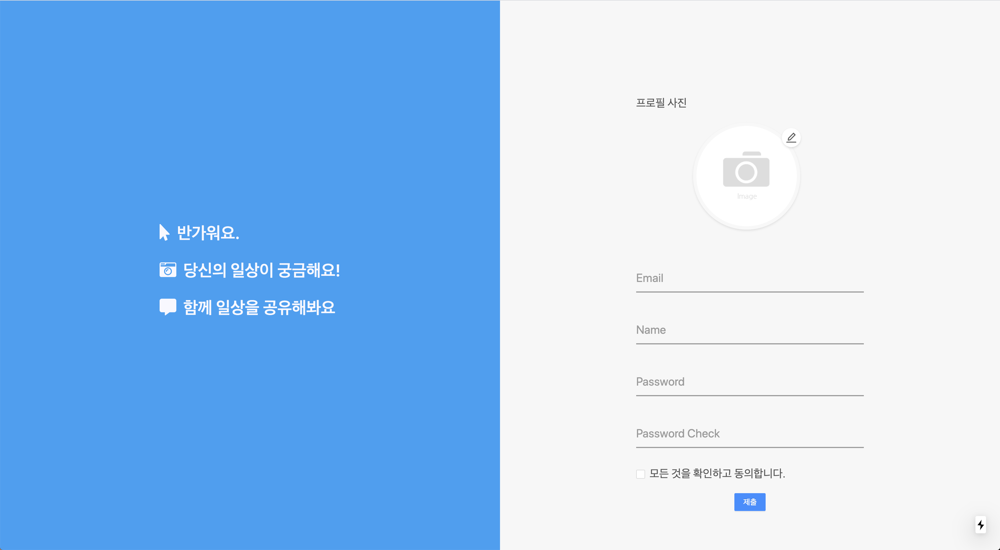
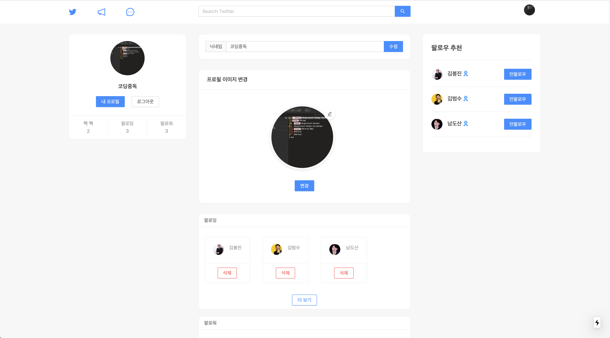
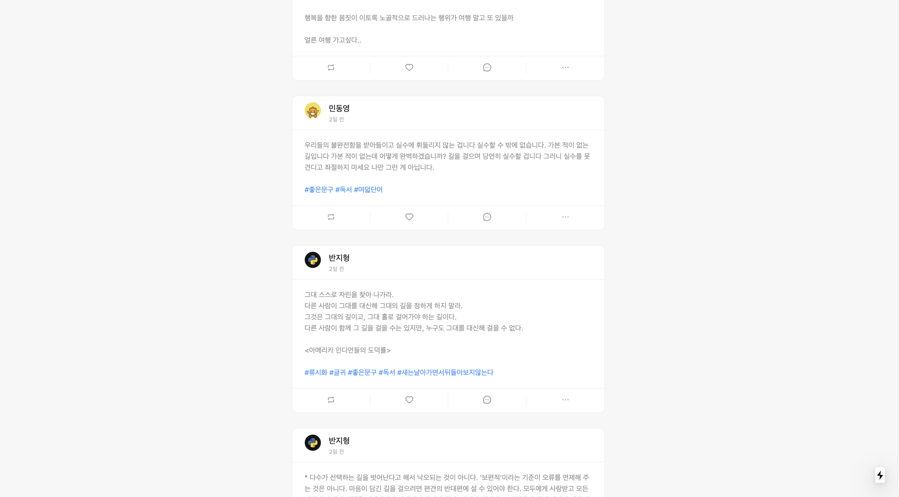
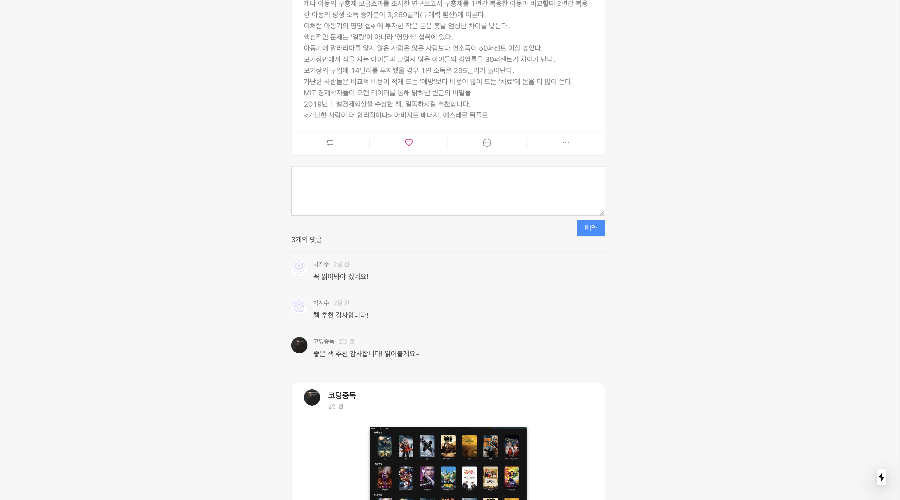
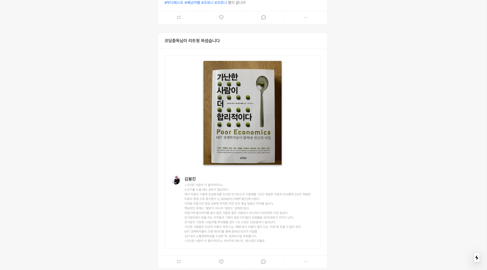

## 🦄 NodeBird

Twitter를 clone 코딩하며 Redesign을 하였습니다. 게시글을 쓸 수 있으며 사진 첨부와 태그 기능을 만들었습니다 또한 팔로우 추천, 리트윗, 댓글, 좋아요 기능이 있으며 영향력 있는 사용자일 경우 이름 옆에 파란 리본이 붙습니다. 반응형으로 구현했으며 내 프로필에서 팔로잉, 팔로우 현황을 볼 수 있으며 닉네임, 프로필 사진을 변경할 수 있습니다. 🤩

***

### 🎖 구현 기능

#### ✅ &nbsp;로그인, 회원가입
 

로그인, 회원가입 기능을 구현하였습니다. 비로그인 시 post 최상단에 회원가입을 유도하는 Post-Card를 추가하였습니다

#### ✅ &nbsp;유저 프로필
 

User들의 Avatar를 구현하여 내 프로필 정보에 들어가면 Avatar 사진과 닉네임을 변경할 수 있으며 현재 팔로우와 팔로잉 리스트를 확인과 삭제가 가능합니다

#### ✅ &nbsp;팔로우 추천 리스트
 

영향력 있는 User를 추천해 주는 기능입니다. 3명씩 추천을 해주며 관리자의 승인을 거친 후 영향력이 있는 유저는 이름 뒤 파란 리본이 붙습니다

#### ✅ &nbsp;#태그기능
 

게시글을 작성 후 태그 기능을 구현했습니다 정규 표현식으로 #을 제거한 후 단어들을 DB에 저장합니다 나아가 해당 태그를 클릭식 같은 태그를 추가한 게시물들을 볼 수 있습니다. 그리고 검색창에서 검색도 가능합니다

#### ✅ &nbsp;리트윗, 댓글, 좋아요

  

마음에 드는 게시글을 리트윗을 할 수 있으며 댓글과 좋아요를 할 수 있습니다.

#### ✅ &nbsp;인피니티 스크롤

sns 특성상 많은 포스트들이 있는데 한 번에 모든 포스트를 받아오기에는 무리가 있어 처음에는 일정량의 포스트들을 불러온 후 스크롤이 아래로 갈수록 포스트를 더 불러올 수 있도록 구현하였습니다

***

### 📌 기술 스택
#### 💎 Front
- React
- Next.js
- Styled-Components
- Sass
- Redux
- Redus-Saga

#### 💎 Back
- Node.js
- Express
- MySQL
- Sequelize

***